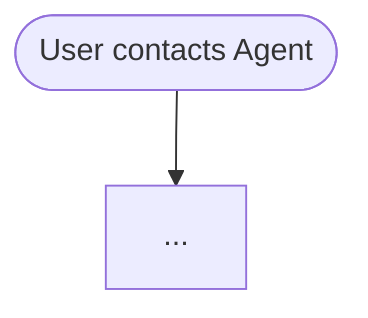

# Mermaid SOP Conversion Prompt

## Instructions

Convert the above agent prompt into a structured SOP as a single markdown file. The file has two main parts:

1. **SOP Flowchart** — a clean mermaid graph with concise node descriptions. This goes directly in the agent's system prompt.
2. **Node Prompts** — detailed instructions, tools, and examples per node, delivered progressively via `goto_node()` at runtime.

Because the mermaid graph is visible to the agent in the system prompt, **node IDs must be self-documenting** and **node descriptions should be concise** — the detailed instructions live in Node Prompts.

Guidelines:
- **Convert** procedural instructions (if/then logic, decision trees, multi-step workflows) into the flowchart
- **Keep as prose** anything that's global context, tone guidance, or doesn't map naturally to a flow
- Don't over-decompose — trust the model to handle straightforward steps without spelling out every micro-action. A node can represent a meaningful *chunk* of work, not just one atomic action.

## Node ID Conventions

Node IDs follow a `PREFIX_DOMAIN` pattern so the graph reads as a narrative.

**Prefixes by purpose:**

| Prefix | Purpose | Example |
|--------|---------|---------|
| `AUTH_` | Authentication / identity verification | `AUTH_EMAIL`, `AUTH_USER` |
| `ROUTE_` | Intent routing / top-level dispatch | `ROUTE_INTENT` |
| `CHK_` | Status check / validation before action | `CHK_CANCEL`, `CHK_RETURN` |
| `IS_` | Boolean condition / status decision | `IS_PENDING`, `IS_DELIVERED` |
| `COLLECT_` | Gather inputs from user | `COLLECT_CANCEL`, `COLLECT_RETURN` |
| `DO_` | Execute an action / call a write tool | `DO_CANCEL`, `DO_EXCHANGE` |
| `END_` | Successful / neutral terminal | `END_CANCEL`, `END_MODIFY` |
| `DENY_` | Rejection terminal | `DENY_CANCEL`, `DENY_RETURN` |
| `ESCALATE_` | Handoff terminal | `ESCALATE_HUMAN` |

**Domain suffixes** identify the flow: `_CANCEL`, `_RETURN`, `_EXCH`, `_MOD`, `_PAY`, `_ADDR`, etc.

**Reading test:** A path like `START → AUTH → ROUTE → CHK_CANCEL → IS_PENDING → COLLECT_CANCEL → DO_CANCEL → END_CANCEL` should tell the story without any node text.

**Decision nodes** (`{rhombus}`) keep their text since it defines branching logic, so their IDs are less critical but should still follow conventions: `IS_PENDING`, `ROUTE_INTENT`, `MOD_TYPE`.

## Mermaid Conventions

**Format:** Always `flowchart TD`, starting with `START([User contacts Agent])`

**Node shapes — only three:**

| Shape | Syntax | Use for |
|-------|--------|---------|
| Stadium | `([text])` | Start, end, and terminal outcomes |
| Rectangle | `["text"]` | Actions, steps, collecting info (concise description only) |
| Rhombus | `{text}` | Decisions, intent routing |

No parallelogram/annotation nodes in the mermaid. All detailed instructions, reminders, tools, and examples go in the **Node Prompts** section.

> ⚠️ **Mermaid syntax gotcha:** Parentheses `()` inside ANY node text cause parse errors — Mermaid interprets them as shape delimiters. Use `"double quotes"` or rephrase.

**Links and branching:**
- Arrow for flow: `A --> B`
- Condition on link: `A -->|order.status == 'shipped'| B`
- Default/fallback: `A -->|else| B`
- Error/escalation (dotted): `A -.->|unresolved| ESCALATE_HUMAN([Escalate to human])`

**Terminal nodes** should encode the outcome clearly:
`DENY_RETURN([DENY: Return window expired])`, `END_REFUND([Issue refund + confirm via email])`, `END_RESTART([End / Restart])`

## Output Format

The conversion should produce a single markdown file with this structure:

```
---
agent: {agent_id}
version: 1.0
entry_node: START

model:
  provider: {provider}
  name: {model_name}
  temperature: {0.0-1.0}
  max_tokens: {number}

api:
  base_url: {api_url}
  api_key: ${ENV_VAR_NAME}

mcp_servers:
  - name: {server_name}
    url: {server_url}
    description: {what tools this server provides}

tools:
  - {tool_name_1}
  - {tool_name_2}
---

# {Agent Name}

## Role
One-line description of what this agent does.

## Global Rules
Prose bullet points — behavioral constraints that apply throughout.

## Domain Reference
Structured reference material — entities, statuses, attributes.
Not procedural — just lookup data.

## SOP Flowchart



## Node Prompts

### {NODE_ID}

```yaml
tools: [tool_a, tool_b]
examples:
  - user: "example input"
    agent: "example response"
```

Free-form prompt text with detailed instructions, policy, caveats...
```

**Section rules:**
- **Frontmatter** — agent config, model settings, MCP servers, master tool list. API keys use `${ENV_VAR}` references, never raw values. Tools listed here are the complete set — node-level `tools` must be a subset.
- **Role** — one sentence. The agent should know its identity immediately.
- **Global Rules** — only what applies *everywhere*. Flow-specific rules go in Node Prompts.
- **Domain Reference** — no procedures, no if/then logic. Just the data model.
- **SOP Flowchart** — clean mermaid with concise node descriptions. No detailed instructions here.
- **Node Prompts** — keyed by `### NODE_ID`. Optional `yaml` fenced block for structured metadata (tools, examples). Everything after the yaml block is the prompt. Nodes that are self-evident from the mermaid (simple decisions, terminals) can be omitted.

## Key Principles

1. **One flat graph** — no subgraphs. If the flow exceeds ~20 nodes, simplify by consolidating related steps rather than splitting into subgraphs.
2. **Node IDs are the narrative** — use the PREFIX_DOMAIN convention so the graph is readable and plannable.
3. **Mermaid descriptions are concise** — one-line labels for what the agent should do. Detailed policy, reminders, and examples go in Node Prompts.
4. **Every decision node must have all exit paths defined**, including a fallback/else.
5. **Don't invent tools or API calls** — only reference tools in Node Prompts if the source prompt explicitly mentions them. All tools must appear in the frontmatter `tools` list.
6. **Terminal nodes as completion markers** — terminal node IDs (e.g. `END_CANCEL`, `DENY_RETURN`) are used as `completion_node` values in the todo system. Name them clearly to reflect the outcome.
