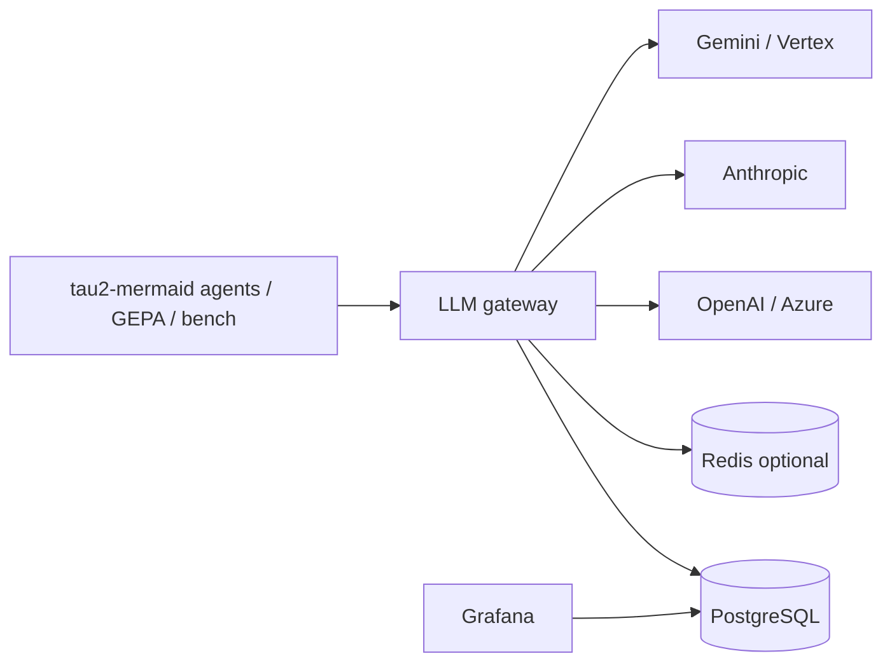

# LLM gateway roadmap

This document is the **single source of truth** for building a custom LLM HTTP gateway (proxy), normalized telemetry, **PostgreSQL** storage, and operator dashboards. It is written so work can be split across junior and senior engineers without ambiguity.

## Goals

- Intercept all outbound LLM traffic for **RPM**, **TPM**, **cost**, and **rate limits**.
- Present **vendor-native edge APIs** (OpenAI-, Anthropic-, Gemini-compatible routes) while **normalizing** behavior inside the gateway.
- Persist an **append-only event log** in **PostgreSQL** for enterprise reporting and drill-down.
- Add models and providers incrementally behind the same core.

## Principles (non-negotiable)

1. **One internal representation** — Every adapter maps to the same normalized request/response and usage types (field names stable; version the schema).
2. **Events before dashboards** — Metrics and Grafana panels read from stored events or aggregates derived from them, not from ad-hoc printf logs alone.
3. **No prompt bodies in v1** — Do not store message content in Postgres by default. Use opaque ids, hashes, and metadata. A separate “debug tier” with TTL requires explicit product/security sign-off.
4. **Secrets stay on the gateway** — Applications use **gateway API keys**; the gateway holds provider keys.

## Architecture (high level)



## PostgreSQL: role and conventions

- **Primary store** for `llm_events` (append-only) and optional config tables (`tenants`, `api_keys`, `rate_limit_policies`, `pricing_versions`).
- **Partition** large tables by time (e.g. monthly `PARTITION BY RANGE (occurred_at)`) once volume grows; start with a single table for v1 if simpler.
- Use **`event_version`** (int or semantic) on every row so migrations can coexist with old readers.
- Index for common dashboards: `(occurred_at DESC)`, `(tenant_id, occurred_at DESC)`, `(model_resolved, occurred_at DESC)`, `(provider, occurred_at DESC)`.

### Starter DDL sketch (v1)

Adjust types/names to your ORM; this is the intended shape:

```sql
-- Optional: tenants and keys (or use external IdP + hashed key lookup)
CREATE TABLE gateway_tenants (
  id          UUID PRIMARY KEY DEFAULT gen_random_uuid(),
  name        TEXT NOT NULL,
  created_at  TIMESTAMPTZ NOT NULL DEFAULT now()
);

CREATE TABLE gateway_api_keys (
  id          UUID PRIMARY KEY DEFAULT gen_random_uuid(),
  tenant_id   UUID NOT NULL REFERENCES gateway_tenants (id),
  key_hash    TEXT NOT NULL UNIQUE,  -- store hash only, never raw key
  label       TEXT,
  created_at  TIMESTAMPTZ NOT NULL DEFAULT now(),
  revoked_at  TIMESTAMPTZ
);

-- Append-only usage / telemetry
CREATE TABLE llm_events (
  id                UUID PRIMARY KEY DEFAULT gen_random_uuid(),
  event_version     SMALLINT NOT NULL DEFAULT 1,
  event_type        TEXT NOT NULL,  -- e.g. llm.response.completed, llm.error, policy.denied
  occurred_at       TIMESTAMPTZ NOT NULL DEFAULT now(),

  request_id        TEXT NOT NULL,
  trace_id          TEXT,
  tenant_id         UUID NOT NULL REFERENCES gateway_tenants (id),

  provider          TEXT NOT NULL,  -- openai | anthropic | google | ...
  route             TEXT NOT NULL,  -- e.g. openai.chat.completions
  model_requested   TEXT NOT NULL,
  model_resolved    TEXT,

  stream            BOOLEAN NOT NULL DEFAULT false,
  latency_ms        INTEGER,
  ttfb_ms           INTEGER,       -- optional, streaming

  http_status       INTEGER,
  error_code        TEXT,
  error_class       TEXT,

  input_tokens      INTEGER,
  output_tokens     INTEGER,
  cache_read_tokens INTEGER,         -- nullable, provider-specific

  cost_usd          NUMERIC(18, 8),
  pricing_version   TEXT,            -- e.g. pricing-2025-03-01

  -- No raw prompts in v1; optional safe metadata:
  agent_name        TEXT,
  environment       TEXT
);

CREATE INDEX idx_llm_events_occurred ON llm_events (occurred_at DESC);
CREATE INDEX idx_llm_events_tenant_time ON llm_events (tenant_id, occurred_at DESC);
CREATE INDEX idx_llm_events_model_time ON llm_events (model_resolved, occurred_at DESC);
```

## Event schema (logical, v1)

Every handler should emit **at least one** of:

| `event_type`            | When |
|-------------------------|------|
| `policy.denied`         | Auth or rate limit rejected before upstream call |
| `llm.response.completed`| Successful completion (non-stream or stream end) |
| `llm.error`             | Upstream error or gateway timeout |

**Required fields (conceptual):** `event_version`, `occurred_at`, `request_id`, `tenant_id`, `provider`, `route`, `model_requested`, `stream`.  
**Populate when known:** usage fields, `latency_ms`, `cost_usd`, `pricing_version`, `http_status`, `error_*`.

## Phases and deliverables

### Phase 0 — Alignment (1–3 days)

| Deliverable | Owner |
|-------------|--------|
| **ADR-001** — Edge routes in v1 (e.g. `POST /v1/chat/completions`, `POST /v1/messages`, Gemini path) | Tech lead |
| **ADR-002** — Event schema v1 + PII policy | Tech lead + 1 engineer |
| **Repo layout** — `proxy/` (or `llm-gateway/`), `adapters/`, `core/`, `storage/`, `deploy/` | Tech lead |
| **Local dev** — `docker compose`: gateway + **PostgreSQL** (+ optional Redis) | 1 engineer |

**Exit:** Everyone runs compose locally; ADRs merged.

### Phase 1 — Skeleton gateway

| ID | Deliverable |
|----|----------------|
| 1A | HTTP app (e.g. FastAPI): `/healthz`, `/readyz`, request-id middleware |
| 1B | API key auth → `tenant_id` (constant-time compare; 401 on failure) |
| 1C | Config via env/YAML (port, DB URL, no real provider calls yet) |
| 1D | CI: lint, tests |

**Exit:** Authenticated `curl` returns stub OpenAI-shaped JSON.

### Phase 2 — OpenAI-compatible path (non-streaming)

| ID | Deliverable |
|----|----------------|
| 2A | Forward `POST /v1/chat/completions` to OpenAI (or Azure); map response |
| 2B | Extract `usage` into normalized structure |
| 2C | Stable proxy error JSON + `request_id` for 401/429/5xx |
| 2D | Integration test (record/replay or gated live key) |

**Exit:** Real completion through gateway; usage available in code.

**Depends on:** Phase 1.

### Phase 3 — PostgreSQL event persistence

| ID | Deliverable |
|----|----------------|
| 3A | `emit_event(...)` with JSON/schema validation |
| 3B | Migrations for `llm_events` (+ tenants/keys if needed) |
| 3C | Writer path (start synchronous; optimize with batch/async later) |
| 3D | Idempotency: unique `id` per event; optional dedup key on `(request_id, event_type)` |

**Exit:** Each Phase 2 call inserts a row (or error event).

**Depends on:** Phase 2.

### Phase 4 — Rate limiting and quotas (v1)

| ID | Deliverable |
|----|----------------|
| 4A | In-process RPM + max concurrency per tenant |
| 4B | Optional Redis-backed limiter for multiple gateway replicas |
| 4C | Config: limits per tenant (DB or config file + migrations) |

**Exit:** Load test receives 429 with clear body; optional `policy.denied` event.

**Depends on:** Phase 1 (tenant); Phase 3 recommended for audit.

### Phase 5 — Streaming (OpenAI path)

| ID | Deliverable |
|----|----------------|
| 5A | SSE proxy: forward chunks, handle disconnects |
| 5B | Finalize event with `stream=true` and usage when API provides it |
| 5C | Tests with mocked SSE |

**Exit:** Streaming clients work; events marked `stream=true`.

**Depends on:** Phases 2–3.

### Phase 6 — Anthropic façade

| ID | Deliverable |
|----|----------------|
| 6A | `POST /v1/messages` (or chosen Anthropic-compatible path) → normalized core |
| 6B | Server-side Anthropic key; map errors and usage |
| 6C | Golden JSON tests (happy path + tools if in scope) |

**Depends on:** Normalization + event pipeline from Phase 2–3 (reuse, do not fork logging).

### Phase 7 — Gemini façade

| ID | Deliverable |
|----|----------------|
| 7A | Single agreed route matching how this repo calls Gemini (e.g. generateContent-style) |
| 7B | Map Google usage fields into common token columns |
| 7C | Separate credential config from OpenAI |

**Depends on:** Same as Phase 6.

### Phase 8 — Cost model

| ID | Deliverable |
|----|----------------|
| 8A | Versioned pricing table (e.g. YAML) — $/1M input and output per `model_resolved` |
| 8B | Unit tests: fixed usage → fixed `cost_usd` |
| 8C | Document how to bump `pricing_version` without rewriting history |

**Depends on:** Phase 3.

### Phase 9 — Dashboards

| ID | Deliverable |
|----|----------------|
| 9A | Grafana (or equivalent) with **PostgreSQL** datasource |
| 9B | Panels: RPM, TPM (from token sums / time), error rate, latency, cost/hour, by tenant, by model |
| 9C | Optional Prometheus for RED metrics exported from gateway process |

**Depends on:** Phase 3 (data). Better after Phase 4–5 for realistic traffic.

### Phase 10 — Production hardening

- Load testing (e.g. k6), connection limits, timeouts.
- Secret rotation runbook.
- Behavior when Postgres is down (queue, drop with metric, or fail closed — **decide in ADR**).
- On-call playbook (429 storms, provider outages).

## Work distribution (RACI-style)

| Role | Typical ownership |
|------|-------------------|
| Tech lead | ADRs, adapter contracts, streaming PR review, Redis limiter correctness |
| Mid-level | OpenAI adapter v1, streaming, provider error mapping |
| Juniors | Health checks, auth scaffolding, SQL migrations, Grafana panels, unit/golden tests, pricing tests, runbooks |
| All PRs | Schema-compatible events for new behavior; no secrets in repo |

### Parallel tracks (after Phase 1)

- **Track A:** Phase 2 → 5 (OpenAI depth: non-stream → stream).
- **Track B:** Phase 3 → 9 (Postgres + Grafana).
- **Track C:** Phase 4 once auth is stable.

**Do not** start Anthropic (6) or Gemini (7) until **normalization + `llm_events` writes** are merged for OpenAI — avoids three divergent code paths.

## Definition of Done (per feature)

- [ ] Unit tests for request/response mappers (golden fixtures).
- [ ] Integration or recorded test where applicable.
- [ ] `llm_events` row (or `llm.error` / `policy.denied`) for the new path.
- [ ] Grafana panel or SQL snippet documented for any new user-visible metric.
- [ ] Runbook updated (config knobs, troubleshooting).

## Integration with this repository

Outbound LLM usage today is spread across native clients and LiteLLM (e.g. `agent/agent_openai.py`, `agent/agent_gemini.py`, `domains/retail/utils/llm_utils.py`, `tau2-bench` utilities). Migration strategy:

1. Run the gateway locally or in staging.
2. Point **base URLs** and **gateway-issued keys** from application config so traffic flows through the gateway only.
3. Remove direct provider keys from app environments once validated.

Keep a checklist per agent or entrypoint when cutting over.

## Implementation status

Phase 1 scaffolding lives in **`llm_gateway/`** (FastAPI app, migrations, Docker Compose, tests). See **`llm_gateway/README.md`** for run instructions.

## Document history

| Date       | Change |
|------------|--------|
| 2025-03-23 | Initial roadmap; PostgreSQL as primary event store |
| 2025-03-23 | Added `llm_gateway` package (stub `/v1/chat/completions`, events, compose) |
