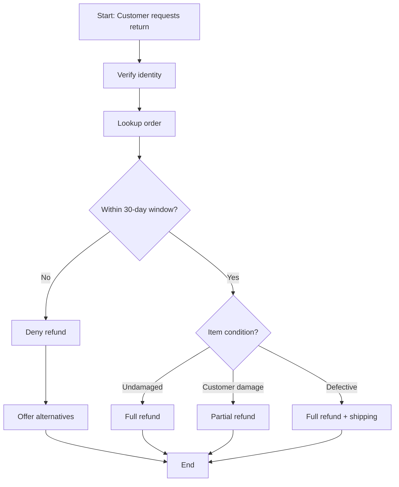
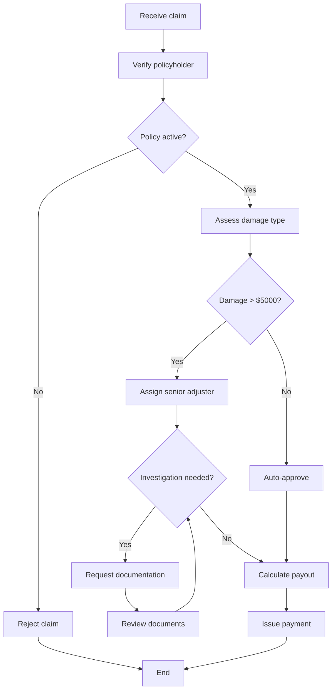

# Graph Traversal Ablation Benchmark: Mermaid + Harness

## 1. Motivation

We want to isolate and measure how well LLMs follow structured workflows represented as graphs. Inspired by τ-bench (which uses pass^k to measure agent reliability), we need a synthetic benchmark that cleanly ablates:

| Condition | Description |
|-----------|-------------|
| **Baseline (Plain Markdown)** | Workflow described in natural language prose (similar to how DOT files were represented as text) |
| **Mermaid Only** | Workflow provided as a raw Mermaid diagram in the system prompt |
| **Mermaid + Harness** | Mermaid diagram + a runtime harness that tracks state, enforces transitions, and provides reminders |

The key metric is **pass^k** — does the agent consistently follow the correct path across multiple trials?

---

## 2. Benchmark Structure

### 2.1 Scenario Generation

Generate **30–50 synthetic scenarios** across 3 complexity tiers, modeled on realistic τ2-style domains (customer service, IT support, insurance claims, HR onboarding, etc.).

**Tier 1 — Linear (5–7 nodes, no branching)**
- Example: Simple order cancellation flow
- Tests: Can the model follow a straight sequence without skipping steps?

**Tier 2 — Branching (8–12 nodes, 2–3 decision points)**
- Example: Return/exchange with eligibility checks, different paths for refund vs. store credit vs. exchange
- Tests: Does the model take the correct branch given user input?

**Tier 3 — Complex (12–20 nodes, loops, parallel paths, error recovery)**
- Example: Insurance claim with investigation loop, escalation paths, approval chains
- Tests: Can the model handle cycles, backtracking, and multi-step conditional logic?

### 2.2 For Each Scenario, Generate:

```
scenario/
├── graph.mermaid          # The canonical Mermaid flowchart
├── graph_prose.md         # Natural language description of the same workflow
├── test_cases/
│   ├── test_01.json       # { prompt, expected_path, expected_actions }
│   ├── test_02.json
│   └── ...
└── metadata.json          # tier, domain, num_nodes, num_edges, num_branches
```

---

## 3. Test Case Design (Reverse-Engineered Prompts)

For each scenario, generate **5–10 test cases** by reverse-engineering user prompts from specific paths through the graph.

### 3.1 Path Selection Strategy

For a graph with paths P1, P2, ..., Pn:

- **Happy path**: The most common/default traversal
- **Edge-case paths**: Paths that hit rarely-visited branches
- **Adversarial paths**: User inputs that are ambiguous or could trigger wrong branches
- **Loop paths**: Paths requiring the agent to revisit a node (e.g., "information insufficient, ask again")
- **Early termination**: Paths where the agent should stop early (e.g., user ineligible)

### 3.2 Test Case Schema

```json
{
  "test_id": "scenario_03_test_02",
  "scenario_id": "scenario_03",
  "user_prompt": "I bought a laptop 45 days ago and the screen is cracked. I want a refund.",
  "expected_path": ["start", "check_warranty", "check_return_window", "deny_refund", "offer_alternatives", "end"],
  "expected_actions": ["lookup_order", "check_policy", "inform_denial", "suggest_repair"],
  "decision_points": {
    "check_return_window": {
      "condition": "purchase_date > 30_days",
      "correct_branch": "deny_refund",
      "wrong_branch": "process_refund"
    }
  },
  "difficulty": "medium",
  "failure_modes": ["skipping warranty check", "approving refund outside window", "not offering alternatives"]
}
```

---

## 4. Three Representation Conditions

### Condition A: Plain Markdown (Baseline)

The workflow is described purely in natural language, paragraph form:

```markdown
## Return Processing Workflow

When a customer requests a return, first verify their identity by asking for
the order number. Then look up the order and check if the item is within the
30-day return window. If the return window has passed, inform the customer
that a refund is not possible but offer repair or store credit as alternatives.
If within the window, check the item condition. If the item is damaged by the
customer, only a partial refund is available...
```

### Condition B: Mermaid Only

The system prompt contains the Mermaid diagram:

~~~markdown

~~~

### Condition C: Mermaid + Harness

Same Mermaid diagram PLUS a runtime harness that:

1. **Tracks current state**: Injects `[CURRENT_STATE: node_X]` into the context
2. **Validates transitions**: Only allows valid next-states per the graph edges
3. **Periodic reminders**: Every N turns, re-injects the graph and current position (inspired by the Claude system-reminder-every-5-turns pattern from the Anthropic blog)
4. **Action logging**: Records each transition for post-hoc evaluation

---

## 5. Evaluation Metrics

### 5.1 Primary: pass^k (Reliability)

Following τ-bench, run each test case **k times** (k = 5 or 8) and report:

- **pass^1**: Did it succeed at least once? (capability ceiling)
- **pass^k**: Did it succeed ALL k times? (reliability floor)

A "pass" means the agent's actual path matches the expected path exactly.

### 5.2 Secondary Metrics

| Metric | What it measures |
|--------|-----------------|
| **Path Accuracy** | % of traversals where the full path matches expected |
| **Node Coverage** | Did the agent visit all required nodes (even if order differs)? |
| **Decision Accuracy** | At each branch point, did the agent take the correct edge? |
| **Skip Rate** | How often does the agent skip a required node? |
| **Hallucinated Node Rate** | How often does the agent invent a step not in the graph? |
| **Loop Adherence** | For cyclic paths, did the agent loop the correct number of times? |
| **Recovery Rate** | If the agent deviates, does it self-correct back to a valid path? |

### 5.3 Aggregate Reporting

Report all metrics broken down by:
- Condition (A vs B vs C)
- Tier (1 vs 2 vs 3)
- Decision point type (binary branch, multi-way, loop)

---

## 6. Implementation Plan

### Phase 1: Scenario + Test Generation (Synthetic)

Use an LLM to generate scenarios:

```
Prompt template:
"Generate a realistic {domain} customer service workflow as a Mermaid flowchart
with {N} nodes and {B} decision points. Include at least one {feature} (loop /
early termination / parallel path). Then generate the equivalent natural language
description. Finally, generate {T} test cases by selecting specific paths and
reverse-engineering realistic user prompts."
```

**Validation**: Manually review ~20% of generated scenarios for:
- Graph correctness (all edges valid, no orphan nodes)
- Prose faithfulness (does the NL description capture all paths?)
- Test case validity (does the expected path actually exist in the graph?)

### Phase 2: Harness Implementation

```python
class GraphHarness:
    def __init__(self, mermaid_str):
        self.graph = parse_mermaid(mermaid_str)
        self.current_node = self.graph.start_node
        self.history = []
        self.turn_count = 0

    def transition(self, next_node):
        if next_node in self.graph.neighbors(self.current_node):
            self.history.append((self.current_node, next_node))
            self.current_node = next_node
            return True
        return False  # Invalid transition

    def get_state_reminder(self):
        return f"[STATE: {self.current_node}] [VALID_NEXT: {self.graph.neighbors(self.current_node)}]"

    def inject_reminder(self, every_n=5):
        self.turn_count += 1
        if self.turn_count % every_n == 0:
            return f"REMINDER: You are at step '{self.current_node}'. " \
                   f"Refer to the workflow graph. Valid next steps: {self.graph.neighbors(self.current_node)}"
        return None
```

### Phase 3: Run Experiments

For each (scenario, test_case, condition, trial):
1. Construct the system prompt per condition
2. Simulate the user interaction (LLM-as-user with the test case prompt)
3. Record the agent's traversal path
4. Compare against expected path
5. Compute all metrics

### Phase 4: Analysis

- Compute pass^k for k ∈ {1, 3, 5, 8}
- Generate ablation tables: Condition × Tier
- Statistical significance tests (McNemar's or bootstrap)
- Error analysis: categorize failure modes per condition

---

## 7. Example Scenario: Insurance Claim Processing

### Mermaid Graph



### Sample Test Cases

**Test 1 (Happy path, auto-approve):**
- Prompt: "I had a minor fender bender, damage is about $2000. Claim number CLM-4421."
- Expected path: A → B → C(yes) → E → F(no) → H → L → M → N

**Test 2 (Investigation loop):**
- Prompt: "My warehouse burned down. Estimated loss $150K. Policy POL-8833."
- Expected path: A → B → C(yes) → E → F(yes) → G → I(yes) → J → K → I(no) → L → M → N

**Test 3 (Early rejection):**
- Prompt: "I want to file a claim. My policy number is POL-0012."
- Context: POL-0012 is expired
- Expected path: A → B → C(no) → D → N

---

## 8. Expected Hypotheses

1. **Mermaid > Plain Markdown** for branching/complex scenarios — the visual structure helps the model track state
2. **Mermaid + Harness >> Mermaid Only** for loop adherence and long conversations — periodic reminders prevent "forgetting"
3. **All conditions ≈ similar** for Tier 1 (linear) — simple flows don't need structural scaffolding
4. **pass^k gap widens with k** — unreliable conditions degrade faster as you demand more consistency
5. **Harness primarily helps with skip rate and loop adherence** — explicit state tracking prevents the most common failure modes

---

## 9. Stretch Goals

- **Cross-model comparison**: Run on Claude, GPT-4o, Gemini to see if the effect is model-dependent
- **Prompt engineering baselines**: Compare against chain-of-thought, "think step by step", etc.
- **Scaling laws**: How does performance degrade as graph complexity increases?
- **Partial credit scoring**: Weighted path similarity (Levenshtein on node sequences) for softer evaluation
